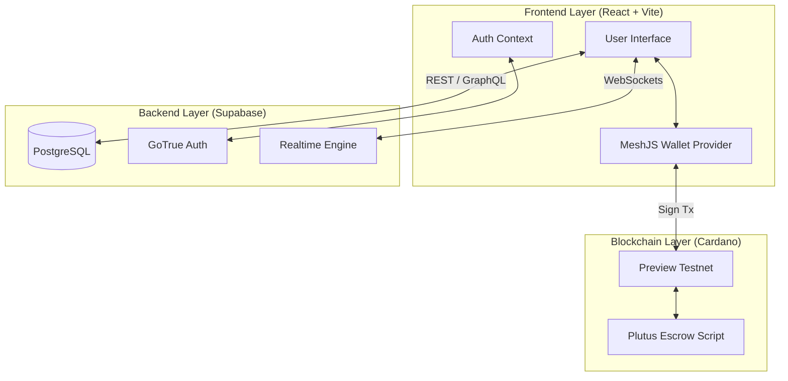

# System Architecture 🏛️

AgriTrust is designed to be a highly resilient, decentralized, and transparent Web3 application. We blend the speed and UX of Web2 (React + Supabase) with the zero-trust security of Web3 (Cardano).

---

## 1. High-Level Architecture Flow

## 2. Component Breakdown

### Frontend (User Experience)
- **Framework:** React 18 with TypeScript.
- **Styling:** Tailwind CSS for a fully responsive, modern Light Theme interface featuring glassmorphism and micro-animations.
- **Routing:** React Router v6 for instantaneous page transitions.
- **State Management:** React Context API for global state (Authentication, Wallet Data).

### Backend (Data & Real-time)
- **Supabase:** Acts as our Serverless backend.
- **Real-time Engine:** When a buyer submits an offer, it is written to PostgreSQL. Supabase instantly broadcasts this change via WebSockets to the farmer's dashboard.
- **Trust Ledger:** A specialized `blockchain_logs` table that stores cryptographic proofs of every action. Each block contains a `prev_hash` linking it to the previous block, creating an immutable, verifiable chain of events.

### Web3 (Cardano & MeshJS)
- **MeshSDK:** We utilize `@meshsdk/react` to inject the `<CardanoWallet />` component. This allows users to connect browser extension wallets (Lace, Nami, Eternl).
- **Escrow Logic:** To protect both parties, funds are never sent directly. When a trade is accepted, the buyer's ADA is transferred to a smart contract address. Once the buyer receives their agricultural goods and clicks "Confirm Delivery", the smart contract releases the ADA to the farmer.
- **Simulation Fallback:** Built specifically for Hackathons. If the Cardano network is congested or a wallet fails, the app abstracts the failure away and falls back to a simulated Web3 layer, ensuring the pitch presentation never crashes.

## 3. Data Integrity & QR Provenance

One of the core features of AgriTrust is the **Verification Passport**.

1. Trade is completed.
2. A block is mined in the Trust Ledger containing the Cardano Transaction Hash (`tx_hash`).
3. A unique URL is generated (`/verify/:id`).
4. `qrcode.react` generates a scannable QR code.
5. Anyone who scans the physical agricultural shipment can view this public ledger verification page, proving exactly when the trade occurred, who the parties were, and the on-chain proof of payment.
